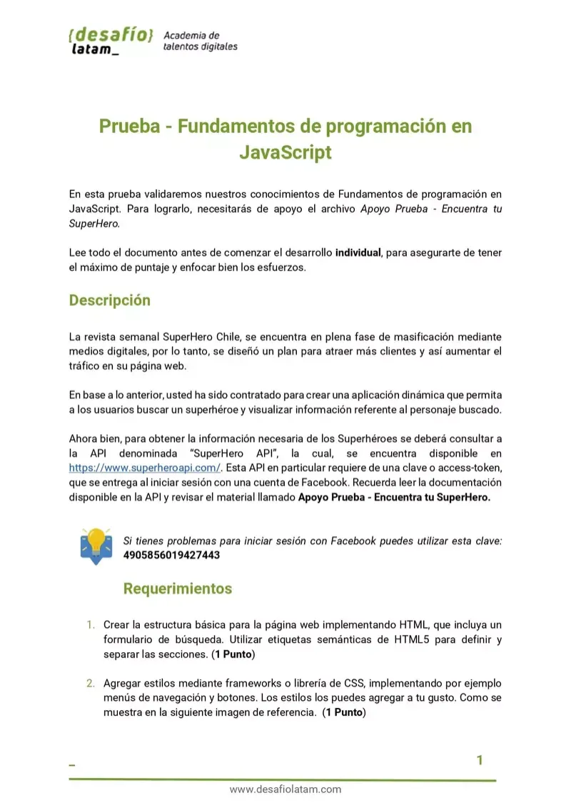
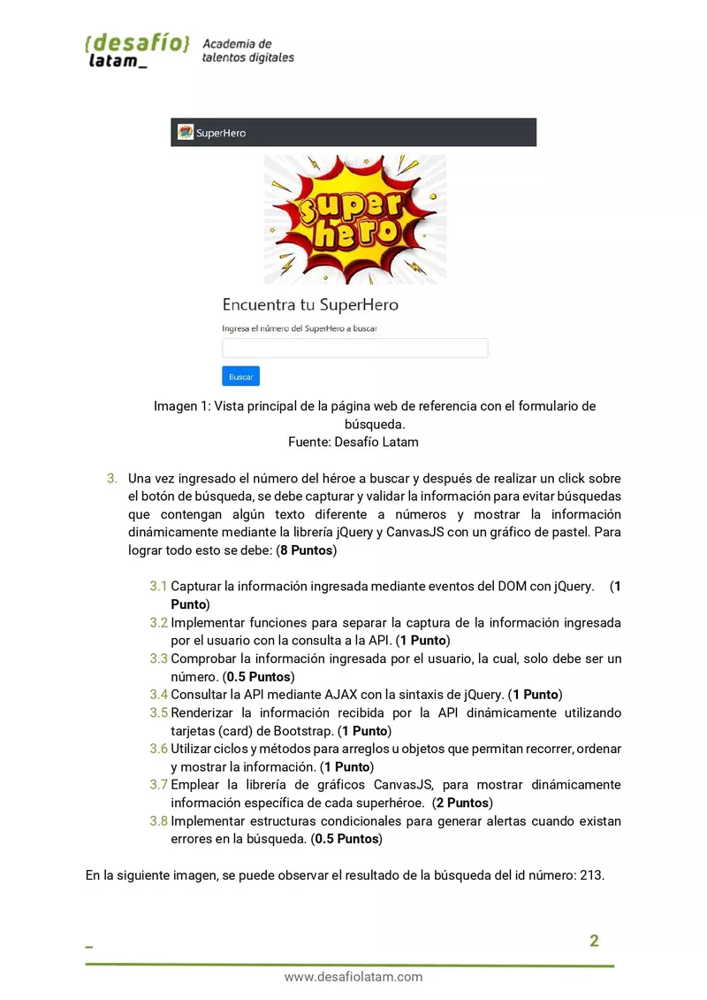
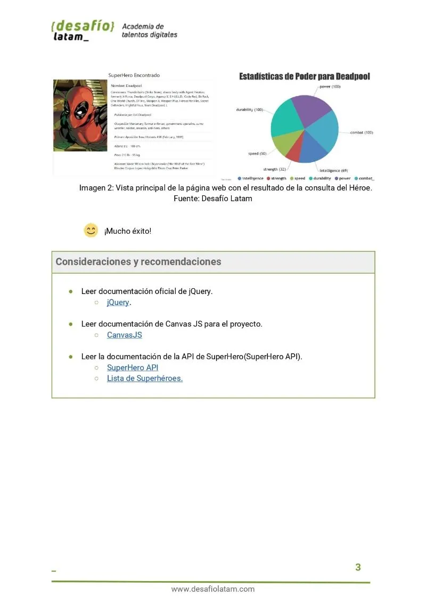
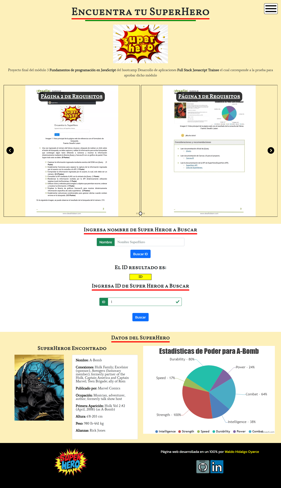
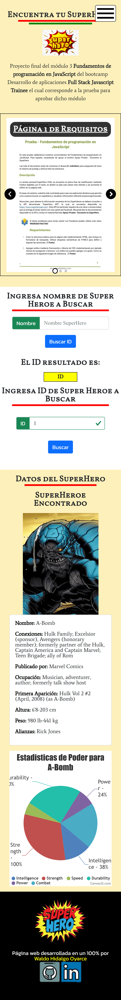
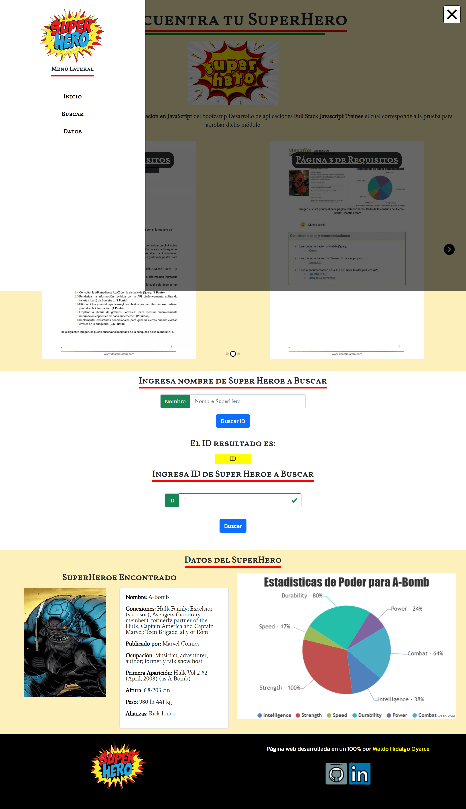

Este repositorio contiene el código de la prueba final del módulo 3 llamando **Fundamentos de programación en JavaScript** de la beca **Desarrollo de aplicaciones Full Stack Javascript Trainee V2.0** de Talento Digital dictada por Desafío Latam.

Las tecnologías utilizadas son las siguientes:

Junto a estas otras librerías: SwiperJS, CanvasJS, Lightbox2 y SweetAlert2. He ido mucho más allá de los requisitos del proyecto implementando las siguientes funcionalidades:

1-Menú Lateral izquierdo utilizando el componente offcanvas de Bootstrap 5 y realización de backdrop de manera manual

2-Implementación de Menú Hamburguesa que he encontrado en Codepen

3-Utilización de la librería Lightbox 2 para crear lightbox sobre algunas imagenes y lograr ahorro de tiempo para no crear lightbox de manera manual

4-Utilización de la librería Swiper JS para crear un carrusel responsivo de manera sencilla.

5-Creación de Sección Búsqueda por Nombre para obtener el ID vía nombre ya que realizar la búsqueda por Id requiere conocer de manera previa el ID y para no colocar la tabla completa de relación de nombres y ID, lo más práctico es colocar una búsqueda de ID por nombre

6-Validación de campos de formulario ingreso de ID utilizando las herramientas de validación de Bootstrap 5.

7-Implementación de alertas vía librería SweetAlert2

8-Creación de Footer

Los requisitos del proyecto son los siguientes:

Mi proyecto en pantallas grandes se ve de este modo:

Y en pantallas pequeñas es el siguiente:

El menú lateral izquierdo desplegado lo muestro acá:

